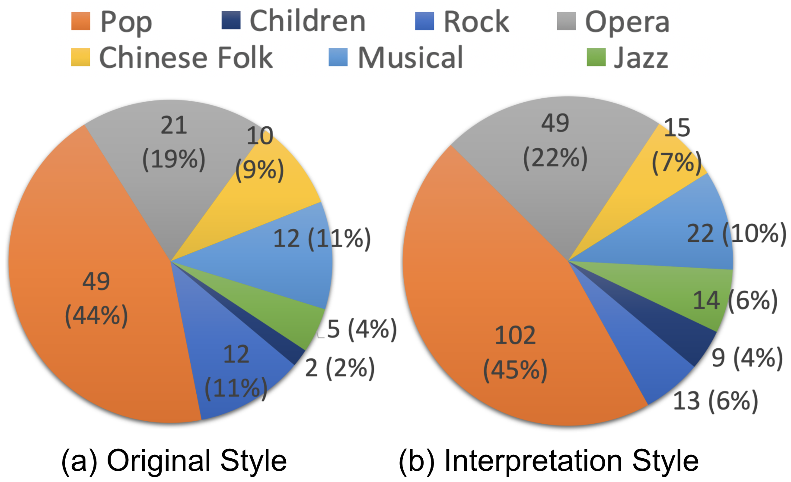

## A Multilingual Singing Dataset with Style Transfer
***SingStyle111*** is a large and high-quality singing dataset. It contains 111 songs performed by eight professional singers, spanning 12.8 hours of clean monophonic vocal recordings in studio quality.

- It is a diverse dataset with creative singing. It covers English, Chinese, and Italian songs and incorporates various singing styles, such as bel canto opera, Chinese folk, pop, jazz, and children. Some performances are creative improvisations based on the original score. 

- It demonstrates style transfer in both performance and timbre levels. 80 songs contain at least two distinct singing styles performed by the same singer.

- It includes proper annotations and extracted features. We manually segmented voices into phrases, aligned the phonemes of lyrics with Performance MIDI files and music score notes, and extracted acoustic features such as Mel-Spectrogram, F0 contour, and amplitude curves. 

- It applies to different MIR tasks such as Singing Voice Synthesis, Singing Voice Conversion, Singing Transcription, Score Following, Expressive Performance, Lyrics Detection, and Singing Style Transfer.

  

##  **Paper**
[SingStyle111: A Multilingual Singing Dataset With Style Transfer](https://www.bing.com)
  

## **Distribution**

 
Researchers can access and download the dataset through a formal application process exclusively for non-commercial and non-profit research purposes. We will review the applications accordingly to prevent potential misuse and malicious spread. We kindly request your understanding and cooperation in this regard.

[Application shortcut](https://www.bing.com)
  

## **Examples**
We provide you here some showcases of the recordings in ***SingStyle111***, demostrating the wide span of the dataset.
  

### Multilingual data
- English  
    ​<audio id="audio" controls controlsList="nodownload" preload="none" >
        <source id="wav" src="examples_multilingual/English_song1.wav">
    </audio>&nbsp;
    ​<audio id="audio" controls controlsList="nodownload" preload="none">
        <source id="wav" src="examples_multilingual/English_song2.wav">
    </audio>&nbsp;
    ​<audio id="audio" controls controlsList="nodownload" preload="none">
        <source id="wav" src="examples_multilingual/English_song3.wav">
    </audio>&nbsp;
- Chinese  
    ​<audio id="audio" controls controlsList="nodownload" preload="none">
        <source id="wav" src="examples_multilingual/Chinese_song1.wav">
    </audio>&nbsp;
    ​<audio id="audio" controls controlsList="nodownload" preload="none">
        <source id="wav" src="examples_multilingual/Chinese_song2.wav">
    </audio>&nbsp;
    ​<audio id="audio" controls controlsList="nodownload" preload="none">
        <source id="wav" src="examples_multilingual/Chinese_song3.wav">
    </audio>&nbsp;
- Italian  
    ​<audio id="audio" controls controlsList="nodownload" preload="none">
        <source id="wav" src="examples_multilingual/Italian-1.wav">
    </audio>&nbsp;
    ​<audio id="audio" controls controlsList="nodownload" preload="none">
        <source id="wav" src="examples_multilingual/Italian-2.wav">
    </audio>

### Multi-style data
- Children  
    <audio id="audio" controls controlsList="nodownload" preload="none">
        <source id="wav" src="examples_multistyle/Children.wav">
    </audio>
- Chinese Folk  
    <audio id="audio" controls controlsList="nodownload" preload="none">
        <source id="wav" src="examples_multistyle/ChineseFolk.wav">
    </audio>
- Jazz  
    <audio id="audio" controls controlsList="nodownload" preload="none">
        <source id="wav" src="examples_multistyle/Jazz.wav">
    </audio>
- Musical  
    <audio id="audio" controls controlsList="nodownload" preload="none">
        <source id="wav" src="examples_multistyle/Musical.wav">
    </audio>
- Opera  
    <audio id="audio" controls controlsList="nodownload" preload="none">
        <source id="wav" src="examples_multistyle/Opera.wav">
    </audio>
- Pop  
    <audio id="audio" controls controlsList="nodownload" preload="none">
        <source id="wav" src="examples_multistyle/Pop.wav">
    </audio>
- Rock  
    <audio id="audio" controls controlsList="nodownload" preload="none">
        <source id="mp3" src="examples_multistyle/Rock.mp3">
    </audio>  

### Style transfer examples

SingStyle111 contains many performances where a single singer performs in multiple styles, offering the potential to abstract styles from other information (singer identity, melodies) which is held constant. In the multi-style recordings, singers were asked to exaggerate differences, which should help to learn features that characterize different styles.

- Song 1
<table>
    <td>
        Pop 
        <audio id="audio" controls controlsList="nodownload" preload="none">
            <source id="mp3" src="examples_transfer/微风细雨-流行.mp3">
        </audio> 
        Chinese Folk 
        <audio id="audio" controls controlsList="nodownload" preload="none">
            <source id="mp3" src="examples_transfer/微风细雨-民族.mp3">
        </audio> 
    </td>
    <td>
        Jazz 
        <audio id="audio" controls controlsList="nodownload" preload="none">
            <source id="mp3" src="examples_transfer/微风细雨-爵士.mp3">
        </audio> 
        Bel Canto Opera 
        <audio id="audio" controls controlsList="nodownload" preload="none">
            <source id="mp3" src="examples_transfer/微风细雨-美声.mp3">
        </audio> 
    </td>
    <td>
        Teresa Teng's Style 
        <audio id="audio" controls controlsList="nodownload" preload="none">
            <source id="mp3" src="examples_transfer/微风细雨-邓丽君.mp3">
        </audio> 
    </td>
</table>

- Song 2
<table>
    <td>
        Pop (Normal) 
        <audio id="audio" controls controlsList="nodownload" preload="none">
            <source id="mp3" src="examples_transfer/茉莉花-流行正常.mp3">
        </audio> 
        Pop (Happy) 
        <audio id="audio" controls controlsList="nodownload" preload="none">
            <source id="mp3" src="examples_transfer/茉莉花-流行欢快.mp3">
        </audio> 
    </td>
    <td>
        Chinese Folk (Key 1) 
        <audio id="audio" controls controlsList="nodownload" preload="none">
            <source id="mp3" src="examples_transfer/茉莉花-民族调1.mp3">
        </audio> 
        Chinese Folk (Key 2) 
        <audio id="audio" controls controlsList="nodownload" preload="none">
            <source id="mp3" src="examples_transfer/茉莉花-民族调2.mp3">
        </audio> 
    </td>
    <td>
        Bel Canto Opera 
        <audio id="audio" controls controlsList="nodownload" preload="none">
            <source id="mp3" src="examples_transfer/茉莉花-美声.mp3">
        </audio> 
    </td>
</table>

- Song 3
<table>
    <td>
        Pop 
        <audio id="audio" controls controlsList="nodownload" preload="none">
            <source id="mp3" src="examples_transfer/青春舞曲-流行.mp3">
        </audio> 
        Pop (Exaggerated) 
        <audio id="audio" controls controlsList="nodownload" preload="none">
            <source id="mp3" src="examples_transfer/青春舞曲-流行夸张.mp3">
        </audio> 
    </td>
    <td>
        Pop (Bel Canto-Like) 
        <audio id="audio" controls controlsList="nodownload" preload="none">
            <source id="mp3" src="examples_transfer/青春舞曲-流行偏美声.mp3">
        </audio> 
        Bel Canto Opera 
        <audio id="audio" controls controlsList="nodownload" preload="none">
            <source id="mp3" src="examples_transfer/青春舞曲-美声.mp3">
        </audio> 
    </td>
    <td>
        Pop (Chinese Folk-Like) 
        <audio id="audio" controls controlsList="nodownload" preload="none">
            <source id="mp3" src="examples_transfer/青春舞曲-流行偏民族.mp3">
        </audio> 
        Chinese Folk 
        <audio id="audio" controls controlsList="nodownload" preload="none">
            <source id="mp3" src="examples_transfer/青春舞曲-民族.mp3">
        </audio> 
    </td>
</table>

- Song 4
<table border="0">
<td>
    Jazz 
    <audio id="audio" controls controlsList="nodownload" preload="none">
        <source id="mp3" src="examples_transfer/盛夏的果实-jazz.mp3">
    </audio> 
</td>
<td>
    Pop 
    <audio id="audio" controls controlsList="nodownload" preload="none">
        <source id="mp3" src="examples_transfer/盛夏的果实-pop.mp3">
    </audio> 
</td>
<td>
    Teresa Tengs' Style 
    <audio id="audio" controls controlsList="nodownload" preload="none">
        <source id="mp3" src="examples_transfer/盛夏的果实-邓丽君.mp3">
    </audio> 
</td>
</table>

- Song 5
<table>
    <td>
        Pop 
        <audio id="audio" controls controlsList="nodownload" preload="none">
            <source id="wav" src="examples_transfer/记住乡愁-流行.wav">
        </audio> 
    </td>
    <td>
        Bel Canto Opera 
        <audio id="audio" controls controlsList="nodownload" preload="none">
            <source id="wav" src="examples_transfer/记住乡愁-美声.wav">
        </audio>
    </td>
</table>

- Song 6
<table>
    <td>
        Jian Li's Style 
        <audio id="audio" controls controlsList="nodownload" preload="none">
            <source id="wav" src="examples_transfer/贝加尔湖畔-New-李健.wav">
        </audio> 
    </td>
    <td>
        JJ Lin's Style 
        <audio id="audio" controls controlsList="nodownload" preload="none">
            <source id="wav" src="examples_transfer/贝加尔湖畔-New-林俊杰.wav">
        </audio> 
    </td>
</table>

- Song 7
<table>
    <td>
        Chinese Folk 
        <audio id="audio" controls controlsList="nodownload" preload="none">
            <source id="wav" src="examples_transfer/声声慢-民族.wav">
        </audio> 
    </td>
    <td>
        Bel Canto Opera 
        <audio id="audio" controls controlsList="nodownload" preload="none">
            <source id="wav" src="examples_transfer/声声慢-美声.wav">
        </audio> 
    </td>
</table>

- Song 8
<table border="0">
<td>
    Pop (Normal) 
    <audio id="audio" controls controlsList="nodownload" preload="none">
        <source id="wav" src="examples_transfer/SomeoneLikeYou-流行正常.wav">
    </audio> 
    Pop (Bel Canto-Like) 
    <audio id="audio" controls controlsList="nodownload" preload="none">
        <source id="wav" src="examples_transfer/SomeoneLikeYou-流行偏美声.wav">
    </audio> 
</td>
<td>
    Pop (Exaggerated) 
    <audio id="audio" controls controlsList="nodownload" preload="none">
        <source id="wav" src="examples_transfer/SomeoneLikeYou-流行夸张.wav">
    </audio> 
    Pop (Happy) 
    <audio id="audio" controls controlsList="nodownload" preload="none">
        <source id="wav" src="examples_transfer/SomeoneLikeYou-流行快乐.wav">
    </audio> 
</td>
<td>
    Pop (Sweet) 
    <audio id="audio" controls controlsList="nodownload" preload="none">
        <source id="wav" src="examples_transfer/SomeoneLikeYou-流行甜美.wav">
    </audio> 
    Bel Canto Opera 
    <audio id="audio" controls controlsList="nodownload" preload="none">
        <source id="wav" src="examples_transfer/SomeoneLikeYou-美声.wav">
    </audio> 
</td>
</table>

- Song 9
<table>
    <td>
        Bel Canto Opera 
        <audio id="audio" controls controlsList="nodownload" preload="none">
            <source id="wav" src="examples_transfer/IDreamedADream-美声.wav">
        </audio>
    </td>
    <td>
        Musical 
        <audio id="audio" controls controlsList="nodownload" preload="none">
            <source id="wav" src="examples_transfer/IDreamedADream-音乐剧.wav">
        </audio> 
    </td>
</table>

- Song 10
<table>
    <td>
        Children 
        <audio id="audio" controls controlsList="nodownload" preload="none">
            <source id="wav" src="examples_transfer/IKissedAGirl-New-Child.wav">
        </audio>
    </td>
    <td>
        Pop 
        <audio id="audio" controls controlsList="nodownload" preload="none">
            <source id="wav" src="examples_transfer/IKissedAGirl-New-Pop.wav">
        </audio> 
    </td>
</table>

    

## **Annotations**

 - **'item_name'**: a string, name of the item listed in the dataset.
 - **'file_category'**: a list indicating train, valid, test set. For example, ['test', 'valid'].
 - **'txt'**: a string, lyrics of the phrase segment, written in original language.
 - **'wav'**: audio waveform, 1-D array of float numbers, sampling rate 24000 Hz.
 - **'sec'**: a float number indicating length of audio waveform in seconds.
 - **'len'**: an integer indicating mel-spectrogram length.
 - **'tempo'**: a number indicating tempo of current song, if there is no score available, tempo = -1.
 - **'hop_length'**: hop size in stft when deriving mel-spectrograms and f0s. default = 128.
 - **'win_length'**: window size in stft when deriving mel-spectrograms and f0s. default = 512.

### Style token
 - **'spk_name'**: a string, name of the singer.
 - **'spk_id'**: an integer indicating singer ID number.
 - **'language'**: two characters indicating language.
 - **'language_id'**: an integer indicating language, 0=chinese, 1=english, 2=korean, 3=italian.
 - **'song_name'**: a string, name of the song.
 - **'song_id'**: an integer indicating song ID.
 - **'style_genre'**: a string, name of song genre.
 - **'style_genre_id'**: an integer indicating genre. Right now only used 0-2.
   0:Pop, 1:Children, 2:Opera, 3:Rock, 4:Country, 5:R&B/Hip-Hop, 6:Jazz/Blues, 7:Western Classical, 8:Religious, 9:Folk/Regional

### Lyrics information
 - **'ph'**: a string containing the sequence of phonemes, seperated by empty space, including 'SP' (slience / rest) and 'AP' (breath event) and other placeholders.
 - **'phone'**: a list of ingeters representing phonemes. Already combined phonome list of different lanugages.
 - **'is_slur'**: a list of 0 / 1 indicating whether the phoneme has a slur with the next phoneme, same length aligned with 'ph' and 'phone'. Usually used when there are two identical successive phonemes.
 - **'word_boundary'**: a list of 0 / 1 indicating the word boundary of phonemes, same length aligned with 'ph' and 'phone'. 1 means boundary.

### Score information
 - **'score'**: a list of notes indicating score of the segment, not necessarily have the same length with phonemes (not performance MIDI but the score). Each note contains two integer numbers, MIDI pitch number, and durations in unit of 32nd notes. For example, [[60, 4], [62, 4], [64, 8]] means two eigth notes of C4 and D4, followed by a quater-note of E4.
 - **'note_score_pitch'**: a list of integers indicating score pitches in MIDI number. Same length with 'score'.
 - **'note_score_dur'**: a list of float numbers indicating score durations in seconds. Same length with 'score'.
 - **'note_score_dur_beat'**: a list of integers indicating score duration beats in unit of 32nd notes. Same length with 'score'.
 - **'ph_score_pitch'**: aligned score pitches for each phoneme, 1-D array of MIDI pitch integer numbers, same length aligned with 'ph' and 'phone'.
 - **'ph_score_dur'**: aligned score durations for each phoneme, 1-D array of float numbers in seconds, same length aligned with 'ph' and 'phone'. Derived from rule-based split methods of note duration to phoneme duration.
 - **'ph_score_onset'**: aligned score onsets for each phoneme, 1-D array of float numbers in seconds, same length aligned with 'ph' and 'phone'. Derived from rule-based split methods of note duration to phoneme duration.
 - **'ph_score_note_dur_beat'**: (optional, right now only used in opencpop) score note duration in unit of 32nd note (not performance MIDI), 1-D array of integers, same length aligned with 'ph' and 'phone'. It is the duration of the note that current phoneme is in. 

### Mel-spectrograms and control signals
 - **'mel'**: GT mel-spectrogram, float array of shape = mel-length x 80 (bin-size).   
   *Notice*: we use tacotron2 to generate this mel-spectrograms in order to match the vocoder
 - **'mel2ph'**: matching phonemes to mel-spectrogram frames. 1-D array, same length with mel-spectrograms ('len'). For example, 1 means this frame aligned with the first phoneme in the phrase. Derived according to 'ph_midi_dur'.
 - **'f0'**: GT foundamental frequency, 1-D array of float numbers, same length with mel-spectrograms ('len'). Derived using DiffSinger submodules.
 - **'pitch'**: a semitone pitch integer sequence derived from F0 in DiffSinger, 1-D array, same length with mel-spectrograms ('len'). Derived using DiffSinger submodules.
 - **'amp'**: GT amplitude, 1-D array of float numbers, same length with 'len', derived using librosa functions.
 - **'ph_midi_onset'**: GT performance MIDI, phoneme starting onsets in seconds, 1-D array of float numbers, same length aligned with 'ph' and 'phone'. In some dataset like 'csd', this phoneme level timing info is not accurate since it is derived from rule-based algorithms.
 - **'ph_midi_dur'**: GT performance MIDI, phoneme duration in seconds, 1-D array of float numbers, same length aligned with 'ph' and 'phone'. 
 - **'pitch_midi'**: a list of MIDI pitch numbers, 0 means Rest or Breath, same length aligned with 'ph' and 'phone'.   
   *Notice*: this is not seperated by MIDI notes but phonemes.
 - **'midi_dur'**: a list of float numbers indicating midi note duration, same length aligned with 'ph' and 'phone'.  
   *Notice*: the duration is the note duration instead of phoneme duration. You might see the same values for successive phonemes, and the value is the total duration of the successive two phonemes because they are in one note. Also, this duration is not score note duration, but performance note duration in seconds.

### Positional features (all derived in data loader, not stored in data file)
 - **'pos'** (used in acoustic_control_timing): 1, 2, ..., phoneme_length
 -  **'phrase_pos'**: 1, 2, ..., mel_length, derived in the data loader.
 - **'note_pos'**: 1-D integer array, same length with mel-spectrograms ('len'), indicating the frame position in current phoneme, derived in the data loader.

  

## **Statistics**
### Repertoire, language and styles
***SingStyle111*** comprises **111** songs, of which **80** have at least two different versions performed in distinct styles by the same singer, resulting in a total of **224** song versions. The dataset encompasses three languages: **English (372 minutes), Chinese Mandarin (307 minutes), and Italian (88 minutes)**.  
The figure below illustrates the number of song versions for each language.

    

The figure below presents the styles of the original songs and all style demonstrations. We consolidated several sub-genres into seven broader styles to streamline the pie chart. For instance, Country, Western folk, Chinese pop, and other pop styles were combined into a single pop genre. Likewise, the Rock category contains Soft Rock, Hard Rock, Alternative Rock, etc.

### Singers
Our **eight singers** have diverse vocal ranges, singing styles, and vocal techniques. They are aged **20 to 63**, and all have received formal musical training for **more than six years**. Six of them are graduates or current students in the voice major at music conservatories. "Male1" is a native American English speaker, and all the others are Chinese. "Female1" has lived in the US for more than five years and received formal English singing training at a music academy.

In the table above, the vocal range is the used range in the dataset.  
P: Pop, C: Children, R: Rock, O: Opera, F: Chinese Traditional Folk, M: Musical, J: Jazz.

